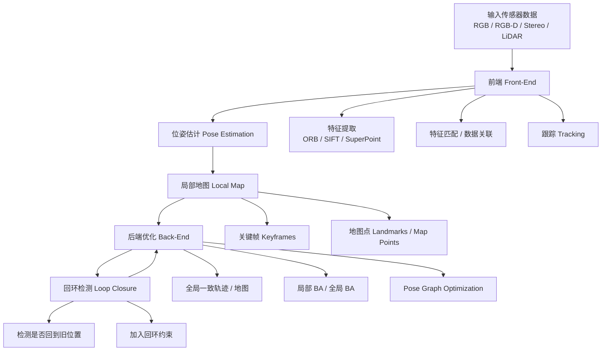
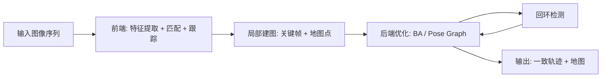

# SLAM 架构图与模块说明

这份文档是给刚接触 SLAM 的同学看的，目标不是把每个数学细节讲完，而是先回答三个问题：

1. SLAM 系统整体长什么样。
2. 每个模块分别做什么。
3. 如果把它作为 final project，应该研究哪一部分。

## 1. SLAM 的总体架构

你可以把 SLAM 理解成一个闭环系统：

- **前端**负责“看懂当前帧和上一帧之间发生了什么”。
- **后端**负责“把前端算出来的结果整体修正得更一致”。
- **回环检测**负责“发现自己绕了一圈又回到了以前来过的地方”，从而纠正累计误差。

---

## 2. 每个模块在做什么

### 2.1 输入数据

SLAM 的输入通常来自：

- `RGB` 相机
- `RGB-D` 相机
- 双目相机 `Stereo`
- 激光雷达 `LiDAR`

如果你是做视觉 SLAM，课程项目里最常见的是 `RGB` 或 `RGB-D` 数据。

### 2.2 前端 Front-End

前端是 SLAM 里最“实时”的部分。它的任务是：

- 从图像里找出有用的视觉信息
- 在相邻帧之间建立对应关系
- 估计相机当前移动了多少

前端通常包括三步：

1. **特征提取**
   - 在图像里找稳定的点、边角、描述子
   - 传统方法：`ORB`, `SIFT`
   - 学习方法：`SuperPoint`

2. **特征匹配**
   - 把当前帧的特征和上一帧或地图里的特征对应起来
   - 例如“这个点是不是同一个物理位置”

3. **跟踪**
   - 利用匹配到的点估计相机位姿
   - 如果匹配不稳定，跟踪就容易丢

### 2.3 位姿估计 Pose Estimation

位姿估计的目标是求出相机当前的位置和朝向，也就是：

- `x, y, z`
- `roll, pitch, yaw`

这一步会把前端的匹配结果变成“相机动了多少”的数学结果。

常见方法：

- `PnP + RANSAC`
- `Essential Matrix`
- `Five-point algorithm`
- `ICP`，如果是点云或 RGB-D 场景

### 2.4 局部地图 Local Map

SLAM 不只是估计轨迹，还要“建图”。

局部地图通常包括：

- **关键帧 Keyframes**
  - 挑选一些最有代表性的帧
  - 不把所有帧都保存下来，否则太冗余

- **地图点 Landmarks**
  - 三维空间中的稀疏点
  - 用来帮助后续帧继续跟踪

局部地图的作用是：

- 给前端提供参考
- 让后续帧更容易定位
- 为后端优化提供约束

### 2.5 后端优化 Back-End

前端的估计会有误差，而且误差会不断累积。  
后端就是专门做“全局修正”的。

它会把很多帧、很多地图点、很多约束一起拿来优化，让结果更一致。

常见后端优化包括：

- **局部 BA**
  - `Bundle Adjustment`
  - 优化局部关键帧和地图点

- **全局 BA**
  - 处理更大范围的整体一致性

- **Pose Graph Optimization**
  - 把每个关键帧看成一个图节点
  - 节点之间的相对位姿关系是边
  - 通过优化这个图减少累计漂移

### 2.6 回环检测 Loop Closure

这是 SLAM 很重要的一块。

比如机器人走了一圈回到原地，系统应该识别出来：

- “我来过这里”
- “我应该把当前轨迹和之前轨迹对齐”

回环检测的作用是：

- 减少长时间运动后的漂移
- 提高地图一致性
- 让轨迹闭合

如果没有回环，轨迹很容易越走越歪。

---

## 3. 这套系统为什么会漂移

SLAM 不是“直接算出完美轨迹”，它会受很多因素影响：

- 光照变化
- 低纹理区域
- 模糊
- 快速运动
- 重复纹理
- 动态物体

这些情况会导致：

- 特征提取不稳定
- 特征匹配错误
- 位姿估计偏差
- 误差在后端里累计

所以你前面提到的“退化场景下的鲁棒性”其实就是在研究：

> 当前端看得不清楚时，SLAM 还能不能稳住。

---

## 4. 你的课程项目应该研究哪一块

如果你想做一个适合 `cs231n` 的 final project，又想和 SLAM 强相关，最合理的是聚焦在 **前端**。

原因很简单：

- 前端是视觉味道最强的部分
- 和深度学习关系最直接
- 容易做对比实验
- 容易出结果图

### 推荐研究问题

你可以把项目表述成：

> 比较传统特征和学习式特征在 SLAM 前端中的表现，看它们在退化场景下谁更稳。

这里你真正研究的是：

- 哪种特征更稳定
- 哪种匹配更可靠
- 哪种方法让后端更少漂移
- 哪种方法在困难场景下更抗退化

### 你可以改进的具体点

你不需要从零实现整个 SLAM。

可以只做这几类改进：

- 把传统特征换成学习特征
- 比较不同特征在匹配数、位姿误差上的差异
- 研究不同退化条件下的性能变化
- 看前端改进如何影响后端优化和回环效果

---

## 5. 一个适合你理解的简化版流程

你可以先把 SLAM 想成下面这个最小版本：

这是最容易入门的版本。

然后再加上 SLAM 的“完整味道”：

这时它就更像一个真正的 SLAM 系统了。

---

## 6. 你可以怎么讲这个项目

如果你以后要在简历、面试、汇报里讲，可以用这个结构：

1. 我先搭了一个简化视觉 SLAM 框架。
2. 我主要研究前端特征表示对系统稳定性的影响。
3. 我对比了传统特征和学习式特征在退化场景下的表现。
4. 我用轨迹误差、匹配质量、跟踪成功率等指标做了评估。
5. 我分析了不同场景下哪种方法更稳，以及为什么。

这样听起来就是一个完整的 research project，而不只是“跑了一个模型”。

---

## 7. 一句话总结

SLAM 的核心架构可以理解为：

**前端负责看，后端负责修，回环负责纠错，地图负责记忆。**

如果你的 final project 要和 SLAM 结合，最适合研究的通常是：

**前端特征/匹配在退化场景下对整体 SLAM 稳定性的影响。**

