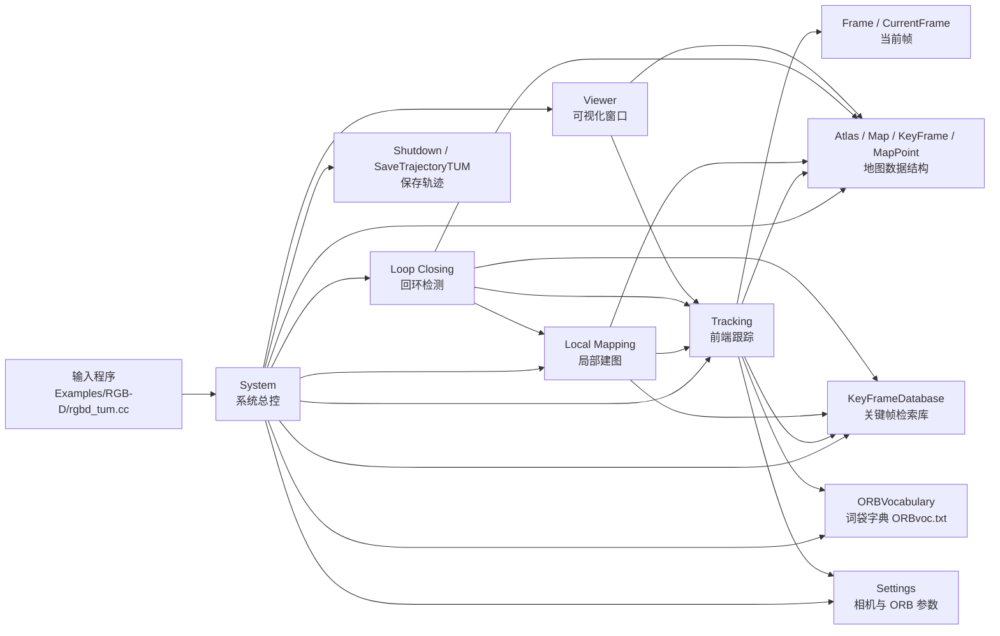

# ORB-SLAM3 架构说明

这份文档用来帮助你快速理解 ORB-SLAM3 的整体结构，以及每个模块在系统里分别做什么。  
你现在已经能跑通 `RGB-D` baseline，所以最重要的不是把每一行代码都读完，而是先搞清楚：

- 数据是怎么进来的
- 位姿是怎么估出来的
- 地图是怎么维护的
- 轨迹是怎么保存的

---

## 1. 总体架构



你可以把 ORB-SLAM3 理解成一个分工明确的系统：

- `Tracking` 负责“看当前帧，估当前位姿”
- `Local Mapping` 负责“把有用的帧和点整理成地图”
- `Loop Closing` 负责“发现自己回到旧地方以后纠正漂移”
- `Viewer` 负责“把结果画出来”
- `System` 负责“把这些模块连起来并统一管理”

---

## 2. 数据流怎么走

RGB-D 版本最典型的数据流是：

```text
rgbd_tum.cc
  -> System::TrackRGBD()
  -> Tracking::GrabImageRGBD()
  -> 特征提取 / 匹配 / 位姿估计
  -> 关键帧判断
  -> Local Mapping / Loop Closing
  -> System::SaveTrajectoryTUM()
```

这条链路是你最应该读懂的主线。

---

## 3. 各模块说明

### 3.1 `Examples/RGB-D/rgbd_tum.cc`

这是 **程序入口**，不是算法核心。

它负责：

- 读取 TUM RGB-D 的图像序列
- 读取对应深度图
- 读取 association 文件
- 把每一帧送进 `System::TrackRGBD()`

你可以把它理解为：

> “把数据喂给 SLAM 系统的外壳程序”

它自己不做定位，也不做建图。

---

### 3.2 `System`

`System` 是 **总控中心**。

它负责：

- 读取配置文件
- 加载 `ORBvoc.txt`
- 创建 `KeyFrameDatabase`
- 创建 `Atlas`
- 创建 `Tracking`
- 创建 `LocalMapping`
- 创建 `LoopClosing`
- 可选地创建 `Viewer`
- 在结束时保存轨迹并关闭线程

你可以把它看成：

> “把整个 SLAM 系统安装起来的人”

它本身不负责算法细节，但负责把所有部件接好。

#### `System` 里最重要的几个接口

- `TrackRGBD(...)`
  - 接收 RGB 和深度图
  - 转发给 `Tracking`

- `Shutdown()`
  - 停掉线程
  - 准备保存轨迹

- `SaveTrajectoryTUM(...)`
  - 把最终相机轨迹写成文件

---

### 3.3 `Tracking`

`Tracking` 是 **前端核心**，也是你后面最值得重点阅读的模块。

它负责：

- 接收当前帧
- 提取 ORB 特征
- 与上一帧或参考关键帧做匹配
- 估计当前相机位姿
- 判断是否需要插入关键帧
- 在跟踪失败时尝试重定位

你后面如果要做“学习式前端替换”，最可能动的就是这里。

#### `Tracking` 里的几个关键函数

- `GrabImageRGBD(...)`
  - 把 RGB-D 输入变成一帧可以处理的内部数据

- `TrackReferenceKeyFrame()`
  - 用参考关键帧来做跟踪

- `TrackWithMotionModel()`
  - 用运动模型预测当前位姿，再做匹配修正

- `StereoInitialization()`
  - 初始化流程的一部分
  - RGB-D / Stereo 场景里会用到类似的初始化逻辑

#### 你可以怎么理解它

`Tracking` 做的是：

> “这一帧图像里有哪些有用点？这些点和之前的地图/关键帧是什么关系？相机这一帧应该在什么位置？”

---

### 3.4 `Local Mapping`

`Local Mapping` 是 **局部建图线程**。

它负责：

- 接收关键帧
- 生成和维护地图点
- 删除质量差的地图点
- 做局部 BA（Bundle Adjustment）

你可以把它理解成：

> “前端把帧送过来以后，这里负责把局部地图修整好”

它和 `Tracking` 是配合关系：

- `Tracking` 负责持续跟踪
- `Local Mapping` 负责把地图整理得更可靠

---

### 3.5 `Loop Closing`

`Loop Closing` 是 **回环检测与纠错模块**。

它负责：

- 用 `ORBvoc.txt` 做地点识别
- 判断当前是否回到了曾经到过的地方
- 加入回环约束
- 纠正累计漂移

如果没有回环，轨迹通常会随着时间越跑越歪。  
有了回环，系统可以把“绕了一圈又回来了”这件事识别出来，然后做全局修正。

---

### 3.6 `Viewer`

`Viewer` 只是 **可视化窗口**，不负责核心算法。

它负责显示：

- 当前帧图像
- 特征点
- 地图点
- 关键帧
- 相机轨迹

你现在看到的左边地图、右边图像窗口就是它画出来的。

---

### 3.7 `ORBVocabulary`

`ORBVocabulary` 是 **词袋字典**，也就是 `ORBvoc.txt` 对应的对象。

它负责：

- 把 ORB 特征转成 BoW（Bag of Words）表示
- 支持地点识别
- 支持回环检测
- 支持重定位

你可以把它理解成：

> “让系统知道哪些特征组合代表相似地点”

---

### 3.8 `KeyFrameDatabase`

`KeyFrameDatabase` 是 **关键帧检索库**。

它负责：

- 保存历史关键帧的 BoW 表示
- 在回环检测时快速找候选帧
- 在重定位时帮助恢复当前位姿

它和 `ORBVocabulary` 是配套关系：

- `ORBVocabulary` 提供“怎么表示相似性”
- `KeyFrameDatabase` 提供“去哪里查相似帧”

---

### 3.9 `Atlas / Map / KeyFrame / MapPoint`

这几个是 **地图数据结构**。

#### `Atlas`

- 管理整个系统的地图集合
- 可以支持多地图
- 是更高层的地图容器

#### `Map`

- 保存地图的整体信息
- 包含关键帧和地图点

#### `KeyFrame`

- 被系统认为“值得保留”的重要帧
- 不是所有帧都能成为关键帧

#### `MapPoint`

- 三维空间中的地图点
- 用来帮助后续帧定位和匹配

你可以把它们理解成：

- `KeyFrame` = 重要照片
- `MapPoint` = 空间中的稳定参照点
- `Map` = 把这些东西组织起来的地图
- `Atlas` = 更大的地图管理器

---

### 3.10 `Settings`

`Settings` 是 **配置读取模块**。

它负责从 YAML 文件里读出：

- 相机内参
- 畸变参数
- 深度尺度
- ORB 参数
- 视图参数

它决定了系统怎么看输入图像，以及 ORB 特征怎么提取。

---

### 3.11 `FrameDrawer` 和 `MapDrawer`

这两个是 **显示辅助模块**。

#### `FrameDrawer`

- 画当前帧中的特征点
- 画跟踪状态

#### `MapDrawer`

- 画地图点
- 画关键帧和相机轨迹

它们和 `Viewer` 一起工作，负责把内部状态可视化。

---

## 4. 为什么系统会漂移

SLAM 不是完美的。它会漂移，主要原因有：

- 特征点不稳定
- 光照变化
- 模糊
- 低纹理
- 重复纹理
- 快速运动
- 动态物体

这些问题会导致：

- 特征提取变差
- 特征匹配出错
- 位姿估计偏掉
- 后端虽然能修，但不是每次都能完全修回来

所以你后面做的“学习式前端鲁棒性研究”，核心就是看：

> 换一种特征表示以后，前端是不是更稳，后端是不是更少被拖累。

---

## 5. 你这个项目最该研究哪一部分

如果你的 final project 想兼顾：

- 研究味道
- 工程可实现性
- 可视化展示

那么最推荐的研究重点是：

> **Tracking 前端**

因为它最直接影响：

- 特征提取
- 特征匹配
- 位姿估计
- 关键帧插入
- 重建连续性

同时它也最容易和深度学习结合。

---

## 6. 建议的阅读顺序

如果你现在想开始读源码，建议按下面顺序：

1. [Examples/RGB-D/rgbd_tum.cc](/D:/Code/slam/external/ORB_SLAM3/Examples/RGB-D/rgbd_tum.cc)
2. [src/System.cc](/D:/Code/slam/external/ORB_SLAM3/src/System.cc)
3. [src/Tracking.cc](/D:/Code/slam/external/ORB_SLAM3/src/Tracking.cc)
4. [include/System.h](/D:/Code/slam/external/ORB_SLAM3/include/System.h)
5. 再按需要看 `LocalMapping.cc`、`LoopClosing.cc`、`Map.cc`

---

## 7. 一句话总结

ORB-SLAM3 可以简单理解成：

> `rgbd_tum.cc` 把数据送进 `System`，`System` 把帧交给 `Tracking`，`Tracking` 负责估位姿，`Local Mapping` 负责建图，`Loop Closing` 负责纠错，`Viewer` 负责显示，最后 `System` 负责保存轨迹。

如果你先把这条链路读懂，后面的前端替换和重建就会顺很多。

